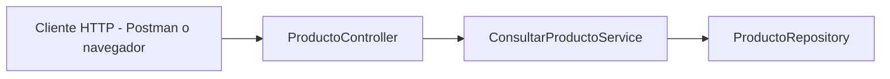

# 📦 Query Service

Servicio de consultas del sistema CQRS, sincronizado con MongoDB vía eventos publicados por Debezium en Apache Kafka.

## 🚀 ¿Qué hace este servicio?

- Escucha los eventos `INSERT`/`UPDATE` generados por cambios en la tabla `producto` en PostgreSQL.
- Guarda automáticamente los productos en MongoDB.
- Expone una API REST para consultar todos los productos o uno por ID.

---

## 🧩 Arquitectura General

Estructura basada en arquitectura **hexagonal (puertos y adaptadores)**:

```
src/main/java/com/example/query
├── application
│   └── service               ← Casos de uso (consultas)
├── domain
│   ├── model                 ← Entidad ProductoDocument
│   └── port
│       ├── in                ← Interfaces de entrada (consultas)
│       └── out               ← Interfaces de persistencia
├── infrastructure
│   ├── kafka                 ← Adaptador de entrada por Kafka
│   ├── persistence           ← Adaptador de salida (MongoDB)
│   └── config                ← Configuración de beans
├── controller                ← Adaptador HTTP REST
└── QueryServiceApplication.java
```

---

## 🔁 Interacción entre componentes

### 1. **Kafka → MongoDB (vía Debezium y Listener Kafka)**

- Debezium publica cambios de PostgreSQL en Kafka.
- `ProductoKafkaConsumer` escucha el topic y guarda los datos en MongoDB usando el repositorio.

```mermaid
flowchart LR
    A[Kafka Topic] --> B[ProductoKafkaConsumer]
    B --> C[ProductoRepository.save()]
```

### 2. **MongoDB → REST API (Consulta)**

- Un cliente externo hace una petición HTTP GET.
- `ProductoController` delega a `ConsultarProductoService`.
- Este servicio usa `ProductoRepository` para consultar MongoDB.



---

## 📥 Endpoints disponibles

| Método | Ruta                       | Descripción                       |
|--------|----------------------------|-----------------------------------|
| GET    | `/api/productos`          | Lista todos los productos         |
| GET    | `/api/productos/{id}`     | Obtiene un producto por su ID     |

---

## ⚙️ Configuración (application.yml)

```yaml
server:
  port: 8082

spring:
  data:
    mongodb:
      host: localhost
      port: 27017
      database: productos_mongo

  kafka:
    consumer:
      bootstrap-servers: localhost:9092
      group-id: query-group
      auto-offset-reset: earliest
      key-deserializer: org.apache.kafka.common.serialization.StringDeserializer
      value-deserializer: org.apache.kafka.common.serialization.StringDeserializer
```

---

## 🧪 Probar API

- Asegúrate de que:
    - El `docker-compose.yml` esté levantado.
    - Debezium esté sincronizando correctamente.
    - `query-service` esté corriendo en el puerto `8082`.

### 🔗 Ejemplo con curl:
```bash
curl http://localhost:8082/api/productos
curl http://localhost:8082/api/productos/123abc
```

---